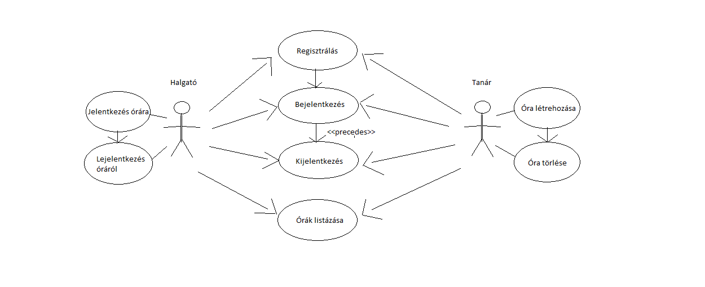

# tanart_keres_kinal
<H2>Projekt eszközök beadandó</H2>
<H3>Bevezető</H3>

Az alapötlet egy tanárt-keres-kínál elven működő alkalmazás létrehozása ahol a tanárok meghirdethetnek órákat különböző területekben és szinteken, a diákok pedig jelentkezhetnek rá.

<H3>Projektötlet</H3>
<H4>Funkcionális követelmények</H4>
<ul>
  <li>Regisztráció</li>
  <li>Bejelentkezés</li>
  <li>Bejelentkezett felhasználóknak
    <ul>
      <li>Adminnak
        <ul>
          <li>Kurzus hozzáadása/módosítása/törlése </li>
          <li>Üzenetek írása </li>
          <li>Tantárgyak megtekintése </li>
          <li>Felhasználók kilistázása/törlése</li>
        </ul>
      </li>
      <li>Tanárnak</li>
        <ul>
          <li>Saját kurzusok módosítása/törlése/megjelenítése </li> 
          <li>Saját kurzusaihoz üzenetek írása </li>
          <li>Tantárgyak megtekintése </li>
          <li>Kommunikáció a diákjaival </li>
        </ul>
      <li>Diáknak</li>
        <ul>
          <li>Kurzusra jelentkezés </li>
          <li>Üzenetek írasa a kurzushoz </li>
          <li>Tantárgyak megtekintése </li>
        </ul>
      <li>Általánosan</li>
        <ul>
          <li>Saját adatok megjelenítése/módosítása</li>
          <li>Kurzusok kilistázása</li>
        </ul>
    </ul>
  </li>
</ul>
<H4>Nem funkcionális követelmények</H4>
<ul>
  <li>Felhasználóbarát: Megfelelően elhatárolt funkciók. Világos látható színekkel írt betűk. Ésszerű elrendezés.</li>
  <li>Biztonság: Jelszóval védett funkciók. A jelszavak titkosítottak. A különböző űrlapoknál egy hibalistában kijelzi a program a hibákat.</li>
  <li>Gyors működés: Adatbázisban operáló program, gyors kereséssekkel hamar előállítja a kívánt eredményeket.</li>
</ul>
<H4>Szerepkörök</H4>
<ul>
  <li>Vendég: nem regisztrált látogató, aki csak a kezdőoldalt tudja megtekinteni, ahol csak regisztrációra/belépésre képes.</li>
  <li>Diák: lásd funkcionális követelmények</li>
  <li>Tanár: lásd funkcionális követelmények</li>
  <li>Admin: lásd funkcionális követelmények</li>
</ul>

<H3>Használati eset diagram</H3>

<H3>Kurzuslétrehozás menete</H3>

<H3>Tervezés</H3>

<H4>Felhasznált eszközök</H4>
<ul>
  <li>Github - verziókezelő</li>
   <li>NetBeans - Java fordító program</li>
  <li>Maven - project management/függőségek kezelése</li>
  <li>Spring/Springboot - keretrenszer</li>
</ul>

<H3>CI működése és projekt elindítás</H3>

CI rendszernek a GitHub Actions -t választottuk ,  a .github/workflows mappába van 3 file ami konfigurálja a CI-t :
frontendBuild.yml - automatikusan build-eli a frontendet (Nodejs) ha a master branchre push-olunk
testMaster.yml - automatikusan buildeli, teszteli és artifecteket készit a backendhez(maven) ha a master branchre push-olunk vagy pull_request-elünk
test_features.yml - automatikusan teszteli a backendet(maven) ha a test branchre push-olunk (ezt az ágat használtuk a tesztek előkészítésére).

Az projekt Actions menüben  látszanak ezek az automatikus futtatások , a trendek alakulása.

Emellett a gyökérkönyvtárban van egy allinone.bat fájl ami birtokában egy kattintással letölthető a github projekt, elindítható a backend és frontend is , utóbbit megnyitja a böngészőben.

test fájlok útvonala : backend/src/test/java/hu/elte/Tanart_Keres_Kinal

